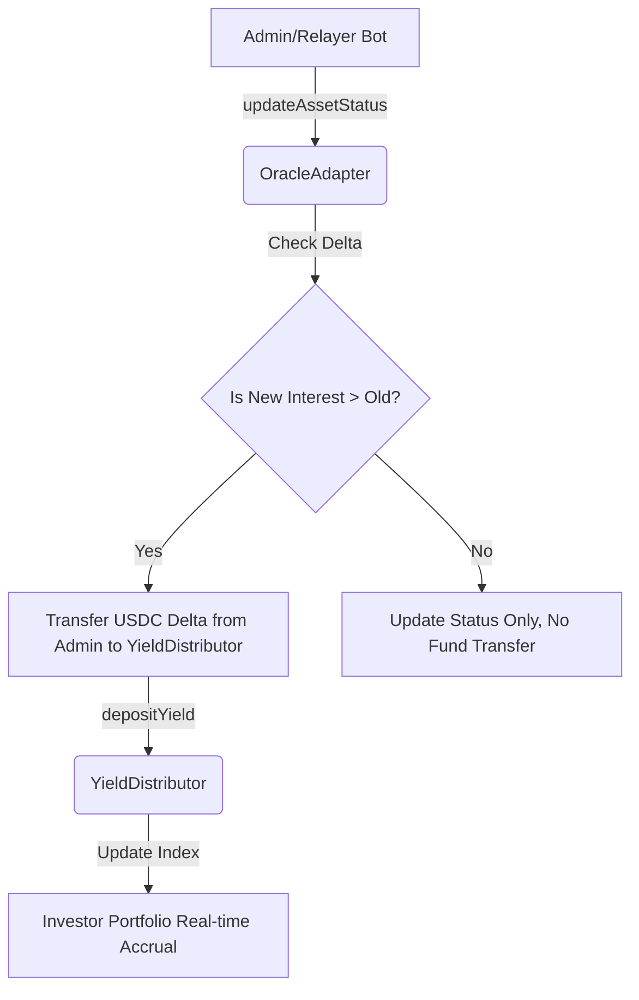

# Oracle Integration & Operation Guide (Detailed)

이 가이드는 BuildCTC 플랫폼의 핵심 데이터 레이어인 **오라클 시스템(Oracle System)**의 운영 및 관리를 위한 종합 매뉴얼입니다. 본 문서는 Phase 1(Mock)부터 Phase 3(Relayer)까지의 모든 내용을 포함하며, 실제 운영 환경에서의 데이터 무결성 유지를 목표로 합니다.

---

## 1. 개요 (Background)

BuildCTC는 실물 자산(RWA) 기반의 이익을 배분합니다. 온체인 스마트 컨트랙트는 오프체인 상환 데이터를 직접 알 수 없으므로, **OracleAdapter**가 게이트웨이 역할을 수행하여 검증된 데이터를 시스템에 주입합니다.

- **Phase 1 (MockOracle)**: 단순 수익 배분 가용성 테스트용.
- **Phase 2 (OracleAdapter)**: 자산 상태 관리, 증분 수익 배분, 검증 증명(Proof)을 포함한 정식 운영 인프라.
- **Phase 3 (Relayer Bot)**: 외부 API를 감시하여 자동으로 데이터를 갱신하는 자동화 시스템.

---

## 2. 사전 요구 사항 (Prerequisites)

시스템 운영을 위해 다음 조건이 충족되어야 합니다.

### A. 네트워크 및 지갑 설정
- **네트워크**: Creditcoin Testnet (Chain ID: 102031)
- **지갑**: MetaMask 또는 유사한 EVM 호환 지갑
- **필요 자산**: 
    - 트랜잭션용 CTC (Testnet)
    - 수익 배분용 MockUSDC (Testnet)

### B. 권한 설정 (Role Management)
오라클 호출을 위해서는 스마트 컨트랙트 상에 다음 권한이 있어야 합니다.
1. `OracleAdapter.ORACLE_ROLE`: 호출자(관리자 또는 봇)에게 부여.
2. `YieldDistributor.DISTRIBUTOR_ROLE`: `OracleAdapter` 계약 주소에 부여 (초기화 완료).

---

## 3. 스마트 컨트랙트 주소 (Testnet)

| Contract | Address | Purpose |
| :--- | :--- | :--- |
| **OracleAdapter** | `0x4F4D9a44b364A039976bC6a134a78c1Df1c7D50E` | 주요 데이터 입구 (V2/V3) |
| **MockOracle** | `0x4022BC37a1F9030f9c0dCA179cb1fFaF26E59bcE` | 레거시/기초 테스트용 (V1) |
| **YieldDistributor** | `0xEbBa8Cec7Dee65bE9263e6378b33EC6D6Dba1308` | 수익 계산 및 유보 엔진 |
| **MockUSDC** | `0x97A41Ff77f70e9328A20b62b393F8Fb0E7e49364` | 정산용 토큰 |

---

## 4. [운영 매뉴얼] 오라클 관리 방식

### 4.1 수동 관리 (Advanced Oracle Hub)
관리자는 `/admin` 페이지의 UI를 통해 직접 데이터를 주입할 수 있습니다.

- **입력 필드**: Cumulative Principal(누적 원금), Cumulative Interest(누적 이자), Status(상태), Proof(증명).
- **작동 원리**: '증분(Delta)' 방식. 입력한 누적 이자가 이전 값보다 높을 때만 차액만큼 투자자에게 배분됩니다.

### 4.2 자동화 운용 (Relayer Bot)
Phase 3에서 도입된 봇을 통해 주기적인 자동 업데이트를 수행합니다.

1.  **설치**: `cd relayer && npm install`
2.  **환경 설정**: `relayer/.env`에 `PRIVATE_KEY` 설정.
3.  **실행**: `npm start`
    *   봇은 30초마다 외부 API 데이터를 스캔합니다.
    *   데이터 변동(Delta > 0) 감지 시 자동으로 `Approve` 및 `updateAssetStatus` 트랜잭션을 실행합니다.

---

## 5. 데이터 흐름 및 로직

---

## 6. 트러블슈팅 (FAQ)

**Q1: "Insufficient Allowance" 에러**
- **해결**: `Approve Delta` (UI) 또는 봇의 자동 승인 로직이 정상 작동하는지 확인하십시오. 리레이어 지갑에 USDC 잔액이 충분해야 합니다.

**Q2: "Unauthorized" 에러**
- **해결**: 호출자 지갑 주소에 `ORACLE_ROLE` 권한이 부여되었는지 확인하십시오.

**Q3: 상환 상태를 바꿨는데 수익 배분이 안 됩니다.**
- **원인**: 누적 이자(Cumulative Interest) 수치가 증가하지 않으면 자산 상태만 업데이트되고 자금 이동은 발생하지 않습니다.

---

## 7. 향후 로드맵

- **완료**: Phase 1 (Mock), Phase 2 (Infrastructure), Phase 3 (Automation Relayer).
- **진행 중**: Data Transparency (투자자 대시보드 시각화 연동 완료).
- **예정**: 실제 핀테크 파트너 프로덕션 API 연동.

---
**최종 업데이트**: 2026-01-17
**버전**: v3.0 (Oracle Full Integration)
**작성**: BuildCTC Core Team / Antigravity Agent
