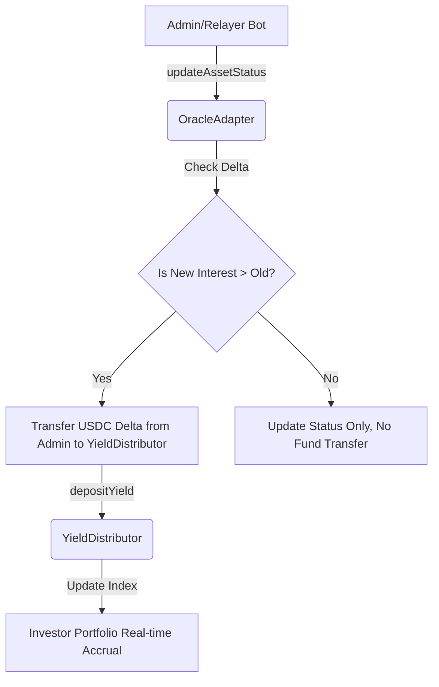

# Oracle Integration & Operation Guide (Detailed)

이 가이드는 BuildCTC 플랫폼의 핵심 데이터 레이어인 **오라클 시스템(Oracle System)**의 운영 및 관리를 위한 종합 매뉴얼입니다. 본 문서는 Phase 1(Mock)과 Phase 2(Adapter)를 모두 포함하며, 실제 운영 환경에서의 데이터 무결성 유지를 목표로 합니다.

---

## 1. 개요 (Background)

BuildCTC는 실물 자산(RWA) 기반의 이익을 배분합니다. 온체인 스마트 컨트랙트는 오프체인 상환 데이터를 직접 알 수 없으므로, **OracleAdapter**가 게이트웨이 역할을 수행하여 검증된 데이터를 시스템에 주입합니다.

- **Phase 1 (MockOracle)**: 단순 수익 배분 가용성 테스트용.
- **Phase 2 (OracleAdapter)**: 자산 상태 관리, 증분 수익 배분, 검증 증명(Proof)을 포함한 정식 운영 모델.

---

## 2. 사전 요구 사항 (Prerequisites)

시스템 운영을 위해 다음 조건이 충족되어야 합니다.

### A. 네트워크 및 지갑 설정
- **네트워크**: Creditcoin Testnet (Chain ID: 1020301)
- **지갑**: MetaMask 또는 유사한 EVM 호환 지갑
- **필요 자산**: 
    - 트랜잭션용 CTC (Testnet)
    - 수익 배분용 MockUSDC (Testnet)

### B. 권한 설정 (Role Management)
오라클 호출을 위해서는 스마트 컨트랙트 상에 다음 권한이 있어야 합니다.
1. `OracleAdapter.ORACLE_ROLE`: 호출자(관리자 또는 봇)에게 부여.
2. `YieldDistributor.DISTRIBUTOR_ROLE`: `OracleAdapter` 계약 주소에 부여 (이미 초기화 완료).

---

## 3. 스마트 컨트랙트 주소 (Testnet)

| Contract | Address | Purpose |
| :--- | :--- | :--- |
| **OracleAdapter** | `0x4F4D9a44b364A039976bC6a134a78c1Df1c7D50E` | 주요 데이터 입구 (V2) |
| **MockOracle** | `0x4022BC37a1F9030f9c0dCA179cb1fFaF26E59bcE` | 레거시/기초 테스트용 (V1) |
| **YieldDistributor** | `0xEbBa8Cec7Dee65bE9263e6378b33EC6D6Dba1308` | 수익 계산 및 유보 엔진 |
| **MockUSDC** | `0x97A41Ff77f70e9328A20b62b393F8Fb0E7e49364` | 정산용 토큰 |

---

## 4. [운영 매뉴얼] Advanced Oracle Hub

이 섹션은 Phase 2 기준의 정식 운영 방식입니다.

### 4.1 데이터 입력 필드 상세 사양
- **Asset Stream (Bond ID)**: 데이터를 업데이트할 대상 채권 ID.
- **Cumulative Principal Paid**: 대출 실행 시점부터 현재까지 상환된 **총 원금**. (단위: $)
- **Cumulative Interest Paid**: 대출 실행 시점부터 현재까지 상환된 **총 이자**. (단위: $)
    - **중요**: 이 시스템은 '증분(Delta)' 방식입니다. 만약 지난번에 $100을 입력했고 이번에 $150을 입력하면, 시스템은 자동으로 차액인 **$50**만큼만 투자자에게 배분합니다.
- **Asset Operational Status**:
    - `Active` (0): 정상 상환 중 혹은 운용 중.
    - `Repaid` (1): 모든 원리금이 상환되어 채권이 종료됨.
    - `Default` (2): 연체 또는 상환 불능 상태 발생. (투자자에게 경고 알림 트리거용)
- **Verification Proof**: 데이터의 근거가 되는 외부 증빙(예: IPFS 해시, 공시 URL, 파트너 서명 데이터 등).

### 4.2 실행 프로세스 (Step-by-Step)
1.  `/admin` 페이지의 **Advanced Oracle Hub**로 접속합니다.
2.  대상 Bond를 선택하고 최신 누적 상환 데이터를 입력합니다.
3.  하단의 **"New Yield to Distribute"** 수치를 확인합니다. (이 수치가 0보다 커야 실제 수익이 배분됩니다.)
4.  `1. Approve Delta` 클릭: 지갑에서 배분할 차액만큼의 USDC 사용을 컨트랙트에 허용합니다.
5.  `2. Sync Status` 클릭: 온체인에 데이터를 기록하고 수익 배분을 확정합니다.

---

## 5. 데이터 흐름 및 로직 (Behind the Scenes)

### 증분(Delta) 계산의 이점
- **멱등성(Idempotency)** 보장: 동일한 데이터를 여러 번 전송해도 이미 배분된 수익은 중복 배분되지 않습니다.
- **정합성 유지**: 오프체인 서비스의 누적 상환 데이터와 온체인 기록을 1:1로 일치시킵니다.

---

## 6. 트러블슈팅 (FAQ)

**Q1: "Insufficient Allowance" 에러가 발생합니다.**
- **원인**: 배분할 이자 금액(Delta)만큼의 USDC 승인(Approve)이 되지 않았습니다.
- **해결**: `Approve Delta` 버튼을 먼저 실행하여 지갑에서 승인을 완료하십시오.

**Q2: "Unauthorized" 에러가 뜹니다.**
- **원인**: 현재 연결된 지갑 주소가 `OracleAdapter`의 `ORACLE_ROLE`을 가지고 있지 않습니다.
- **해결**: Admin 권한이 있는 계정으로 `/admin` 기능을 확인하거나, 관리자에게 주소 등록을 요청하십시오.

**Q3: 상환 상태를 바꿨는데 수익 배분이 안 됩니다.**
- **원인**: `Cumulative Interest Paid` 값이 이전 기록과 동일하거나 더 낮을 경우 이자 배분 로직은 실행되지 않고 상태만 업데이트됩니다.
- **해결**: 이자 배분을 위해서는 실제 누적 이자 수치가 증가해야 합니다.

---

## 7. 보안 관리 지침

- **Oracle Role 분리**: 운영의 안전성을 위해 오라클 호출(Update) 권한과 관리자(Role Grant/Admin) 권한을 분리하여 관리하십시오.
- **Proof 기록 의무화**: 모든 업데이트 시 반드시 `verifyProof`를 포함하여 추후 감사(Audit)가 가능하도록 하십시오.
- **주기적 감사**: `AssetStatusUpdated` 이벤트를 모니터링하여 인가되지 않은 시점의 대규모 데이터 변동을 감시하십시오.

---
**최종 업데이트**: 2026-01-17
**버전**: v2.1 (Oracle Phase 2 Integration)
**작성**: BuildCTC Core Team / Antigravity Agent
