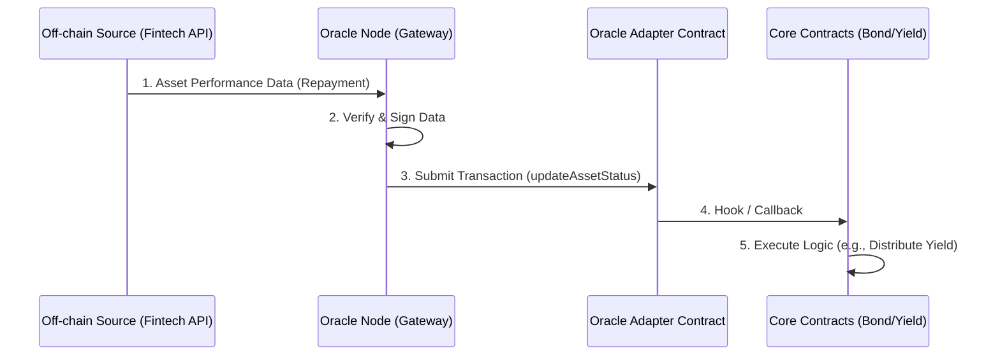
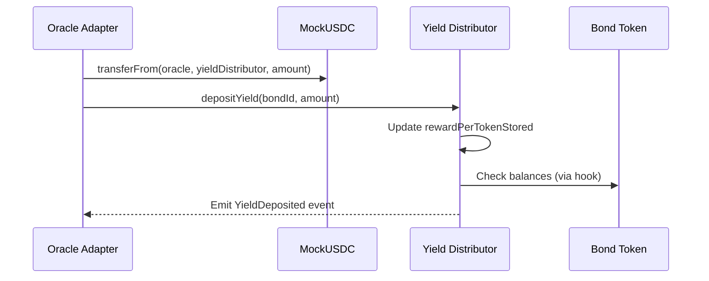

# 14. Oracle Integration Architecture

## 1. 개요 (Overview)
BuildCTC는 실물 자산(RWA, Real World Assets)을 블록체인 상으로 가져와 투자 상품화하는 플랫폼입니다. 블록체인 외부(Off-chain)에 존재하는 실제 자산의 상태(상환 여부, 성과, 신용 등급 등)를 블록체인 내부(On-chain)의 스마트 컨트랙트가 신뢰할 수 있게 검증하고 가져오기 위해서는 **오라클(Oracle)** 시스템이 필수적입니다.
본 문서는 **Creditcoin Universal Oracle**을 활용한 데이터 연동 아키텍처를 정의합니다.

## 2. 목표 (Goals)
1.  **데이터 무결성(Integrity)**: 외부 데이터가 스마트 컨트랙트로 전달되는 과정에서 변조되지 않았음을 보장.
2.  **자동화(Automation)**: 채무자의 상환 내역이나 자산 가치 변동이 자동으로 컨트랙트에 반영되어 수익 배분 등을 트리거.
3.  **투명성(Transparency)**: 오라클을 통해 가져온 모든 데이터와 그 출처를 온체인에 기록하여 누구나 검증 가능하게 함.

## 3. 오라클 아키텍처 (Architecture)

### 3.1 전체 흐름 (Data Flow)


### 3.2 주요 컴포넌트

#### A. Off-chain Data Source (Fintech Partner API)
*   실제 대출/투자 집행 기관(핀테크 파트너)의 ERP 또는 API 시스템.
*   **Provision Data**:
    *   `loan_id`: 대출 고유 식별자.
    *   `repayment_amount`: 상환된 원리금.
    *   `repayment_date`: 상환 일시.
    *   `status`: 정상(Normal), 연체(Overdue), 부도(Default).

#### B. Oracle Node (Gateway Service)
*   **Creditcoin Universal Oracle Gateway** 역할 수행.
*   주기적으로(Polling) 또는 Webhook 방식으로 파트너 API의 데이터를 수집.
*   데이터를 표준화된 포맷으로 변환하고 자신의 개인키(Oracle Private Key)로 서명하여 온체인 트랜잭션 생성.
*   **구현 기술**: Node.js/NestJS 또는 Go (Serverless Functions 권장).

#### C. Oracle Adapter Contract (`OracleAdapter.sol`)
*   오라클 노드로부터 데이터를 수신하는 스마트 컨트랙트 창구.
*   **보안 기능**:
    *   `Trusted Oracle Registry`: 사전에 승인된 오라클 주소(Address)로부터 온 트랜잭션만 허용.
    *   `Events`: 데이터 업데이트 시 `AssetStatusUpdated` 이벤트 발생.
    *   `Interface`: `IOracleAdapter.sol` 인터페이스 제공.

## 4. 데이터 모델 (On-chain Data Structure)

### 4.1 Asset Snapshot
스마트 컨트랙트에 기록될 자산 상태 구조체입니다.
```solidity
struct AssetPerformance {
    uint256 timestamp;      // 업데이트 시각
    uint256 principalPaid;  // 상환된 원금 누적액
    uint256 interestPaid;   // 상환된 이자 누적액
    uint8 status;           // 0: Active, 1: Repaid, 2: Default
    string verifyProof;     // 외부 검증 증명 (IPFS Hash 등)
}
```

## 5. 단계별 구현 계획 (Implementation Phases)

### Phase 1: 오라클 어댑터 초안 (Mock Oracle)
*   개발 및 테스트 목적의 단순화된 오라클.
*   **`MockOracle.sol`**:
    *   `setAssetData(uint256 bondId, uint256 amount)` 함수로 누구나(또는 Admin만) 데이터 주입 가능.
    *   프론트엔드 및 YieldDistributor 로직 테스트용.

### Phase 2: Trusted Oracle Adapter
*   **`OracleAdapter.sol`**:
    *   AccessControl 도입 (`ORACLE_ROLE`).
    *   실제 `YieldDistributor` 컨트랙트가 이 어댑터를 참조하여 수익 배분 가능 여부를 판단하도록 연결.

### Phase 3: 백엔드 게이트웨이 구축
*   핀테크 파트너의 Mock API 서버 구축.
*   이를 주기적으로 체크하여 `OracleAdapter`의 `updateData`를 호출하는 **Relayer Bot** 개발.

## 6. 현재 구현 상태 (Current Implementation Status)

### 6.1 스마트 컨트랙트
#### 구현 완료 ✅
- ✅ `BondToken.sol` (v2)
- ✅ `LiquidityPool.sol`
- ✅ `YieldDistributor.sol` (v2) - `depositYield(uint256 bondId, uint256 amount)` 함수 존재
- ✅ `MockUSDC.sol`

#### 미구현 ❌
- ❌ `MockOracle.sol` (Phase 1)
- ❌ `OracleAdapter.sol` (Phase 2)
- ❌ `IOracleAdapter.sol` (인터페이스)

### 6.2 백엔드 서비스
- ❌ Oracle Node (Gateway Service)
- ❌ Fintech Partner Mock API
- ❌ Relayer Bot
- ❌ Creditcoin Universal Oracle 통합

## 7. YieldDistributor 연동 상세 (Integration Details)

### 7.1 현재 YieldDistributor 구조
현재 `YieldDistributor.sol`은 이미 오라클과의 연동을 지원할 수 있는 구조입니다:
```solidity
function depositYield(uint256 bondId, uint256 amount) external 
    nonReentrant onlyRole(DISTRIBUTOR_ROLE) {
    // 자동으로 rewardPerTokenStored 업데이트
    // 사용자별 수익 계산 및 저장
}
```

### 7.2 OracleAdapter → YieldDistributor 연동 방법

**권장 방식: 직접 호출 (Option 1)**
```solidity
// OracleAdapter.sol
import "@openzeppelin/contracts/token/ERC20/IERC20.sol";
import "./YieldDistributor.sol";

contract OracleAdapter is AccessControl {
    bytes32 public constant ORACLE_ROLE = keccak256("ORACLE_ROLE");
    YieldDistributor public yieldDistributor;
    
    function updateAssetStatus(uint256 bondId, AssetPerformance calldata data) 
        external onlyRole(ORACLE_ROLE) {
        require(data.interestPaid > 0, "No interest to distribute");
        
        // USDC를 YieldDistributor로 전송
        IERC20 usdc = IERC20(yieldDistributor.usdcToken());
        usdc.transferFrom(msg.sender, address(yieldDistributor), data.interestPaid);
        
        // YieldDistributor에 수익 배포 요청
        // OracleAdapter에 DISTRIBUTOR_ROLE 부여 필요
        yieldDistributor.depositYield(bondId, data.interestPaid);
        
        emit AssetStatusUpdated(bondId, data);
    }
}
```

**권한 설정**:
- OracleAdapter 컨트랙트에 `YieldDistributor.DISTRIBUTOR_ROLE` 부여 필요
- 또는 YieldDistributor가 OracleAdapter 주소를 참조하는 별도 함수 구현

### 7.3 연동 시퀀스


## 8. 구체적 구현 계획 (Detailed Implementation Plan)

### 8.1 Phase 1: MockOracle 구현 (1-2주)

#### MockOracle.sol
```solidity
// contracts/contracts/MockOracle.sol
// SPDX-License-Identifier: MIT
pragma solidity ^0.8.20;

import "@openzeppelin/contracts/access/AccessControl.sol";
import "@openzeppelin/contracts/token/ERC20/IERC20.sol";
import "./YieldDistributor.sol";

contract MockOracle is AccessControl {
    bytes32 public constant DISTRIBUTOR_ROLE = keccak256("DISTRIBUTOR_ROLE");
    
    YieldDistributor public yieldDistributor;
    IERC20 public usdcToken;
    
    event AssetDataUpdated(uint256 indexed bondId, uint256 amount);
    
    constructor(address _yieldDistributor, address _usdcToken) {
        _grantRole(DEFAULT_ADMIN_ROLE, msg.sender);
        _grantRole(DISTRIBUTOR_ROLE, msg.sender);
        yieldDistributor = YieldDistributor(_yieldDistributor);
        usdcToken = IERC20(_usdcToken);
    }
    
    function setAssetData(uint256 bondId, uint256 interestAmount) 
        external onlyRole(DISTRIBUTOR_ROLE) {
        require(interestAmount > 0, "Amount must be > 0");
        
        // USDC를 YieldDistributor로 전송
        usdcToken.transferFrom(msg.sender, address(yieldDistributor), interestAmount);
        
        // YieldDistributor에 수익 배포
        yieldDistributor.depositYield(bondId, interestAmount);
        
        emit AssetDataUpdated(bondId, interestAmount);
    }
}
```

#### 테스트 요구사항
- MockOracle에서 `depositYield` 호출 시나리오
- 프론트엔드 Admin 패널 연동
- 사용자 수익 배분 확인

### 8.2 Phase 2: OracleAdapter 구현 (2-3주)

#### OracleAdapter.sol 구조
```solidity
// contracts/contracts/OracleAdapter.sol
contract OracleAdapter is AccessControl {
    bytes32 public constant ORACLE_ROLE = keccak256("ORACLE_ROLE");
    
    struct AssetPerformance {
        uint256 timestamp;
        uint256 principalPaid;
        uint256 interestPaid;
        uint8 status; // 0: Active, 1: Repaid, 2: Default
        string verifyProof; // IPFS Hash 등
    }
    
    mapping(uint256 => AssetPerformance) public assetPerformances;
    mapping(address => bool) public trustedOracles;
    
    YieldDistributor public yieldDistributor;
    
    event AssetStatusUpdated(
        uint256 indexed bondId,
        uint256 principalPaid,
        uint256 interestPaid,
        uint8 status
    );
    
    function updateAssetStatus(uint256 bondId, AssetPerformance calldata data) 
        external onlyRole(ORACLE_ROLE) {
        // 검증 로직
        require(data.interestPaid > 0, "No interest to distribute");
        require(block.timestamp >= data.timestamp, "Invalid timestamp");
        
        // 데이터 저장
        assetPerformances[bondId] = data;
        
        // YieldDistributor에 수익 배포
        IERC20 usdc = IERC20(yieldDistributor.usdcToken());
        usdc.transferFrom(msg.sender, address(yieldDistributor), data.interestPaid);
        yieldDistributor.depositYield(bondId, data.interestPaid);
        
        emit AssetStatusUpdated(bondId, data.principalPaid, data.interestPaid, data.status);
    }
    
    function addTrustedOracle(address oracle) external onlyRole(DEFAULT_ADMIN_ROLE) {
        trustedOracles[oracle] = true;
    }
}
```

#### 인터페이스 정의
```solidity
// contracts/interfaces/IOracleAdapter.sol
interface IOracleAdapter {
    struct AssetPerformance {
        uint256 timestamp;
        uint256 principalPaid;
        uint256 interestPaid;
        uint8 status;
        string verifyProof;
    }
    
    event AssetStatusUpdated(
        uint256 indexed bondId,
        uint256 principalPaid,
        uint256 interestPaid,
        uint8 status
    );
    
    function updateAssetStatus(uint256 bondId, AssetPerformance calldata data) external;
    function getAssetPerformance(uint256 bondId) 
        external view returns (AssetPerformance memory);
}
```

### 8.3 Phase 3: 백엔드 게이트웨이 (1-2개월)

#### 기술 스택
- Node.js/TypeScript
- Express.js 또는 FastAPI
- viem 또는 ethers.js (블록체인 연동)

#### Mock Fintech API 서버
**엔드포인트**: `GET /api/repayments/{bondId}`
```json
{
  "bondId": 1,
  "repaymentAmount": "1000000",
  "principalAmount": "800000",
  "interestAmount": "200000",
  "repaymentDate": "2026-01-16T00:00:00Z",
  "status": "Normal"
}
```

#### Oracle Node (Relayer Bot)
- 주기적 폴링 (예: 1시간마다)
- 데이터 검증 및 서명
- `OracleAdapter.updateAssetStatus` 트랜잭션 제출
- 실패 시 재시도 로직

#### 환경 설정
```env
ORACLE_PRIVATE_KEY=0x...
RPC_URL=https://rpc.cc3-testnet.creditcoin.network
ORACLE_ADAPTER_ADDRESS=0x...
USDC_TOKEN_ADDRESS=0x...
```

## 9. 에러 처리 및 예외 상황 (Error Handling)

### 9.1 Oracle Node 장애
- **대응**: 다중 Oracle Node 운영 (나중에)
- **임시**: 수동 `depositYield` 호출

### 9.2 데이터 불일치
- **검증**: `timestamp` 확인, `verifyProof` 검증
- **롤백**: 이전 상태 유지

### 9.3 가스 비용
- Oracle Node에 충분한 ETH/CTC 보유 필요
- 가스 가격 모니터링 및 알림

## 10. 보안 고려사항 (Security Considerations)

### 10.1 Oracle 주소 관리
- Trusted Oracle Registry 화이트리스트
- 멀티시그 고려 (향후)

### 10.2 데이터 검증
- `verifyProof` IPFS 해시 검증
- 타임스탬프 검증
- 금액 일관성 검증

### 10.3 AccessControl
- `ORACLE_ROLE` 엄격한 권한 관리
- 역할 분리 (Oracle vs Admin)

## 11. 구현 로드맵 (Implementation Roadmap)

### Week 1-2: Phase 1 (MockOracle)
- [ ] MockOracle.sol 구현
- [ ] 단위 테스트 작성
- [ ] YieldDistributor 연동 테스트
- [ ] 프론트엔드 Admin 패널 연동

### Week 3-4: Phase 2 (OracleAdapter)
- [ ] OracleAdapter.sol 구현
- [ ] IOracleAdapter 인터페이스 정의
- [ ] AccessControl 및 보안 테스트
- [ ] YieldDistributor 통합 테스트

### Week 5-8: Phase 3 (Backend)
- [ ] Mock Fintech API 서버 구축
- [ ] Oracle Node (Relayer Bot) 개발
- [ ] Creditcoin Universal Oracle 통합 (문서 확보 후)
- [ ] End-to-End 테스트

## 12. 결론 (Conclusion)
오라클 연동은 BuildCTC가 단순한 토큰 놀이가 아닌 실제 금융 시스템으로 작동하게 하는 핵심입니다. 

**현재 상태**: 설계 완료, 구현 미시작  
**다음 단계**: Phase 1 (MockOracle) 즉시 시작 가능

초기 단계(Phase 1)에서는 `MockOracle`을 통해 빠르게 기능성을 검증하고, 점차 탈중앙화된 신뢰 모델로 고도화할 것입니다.
