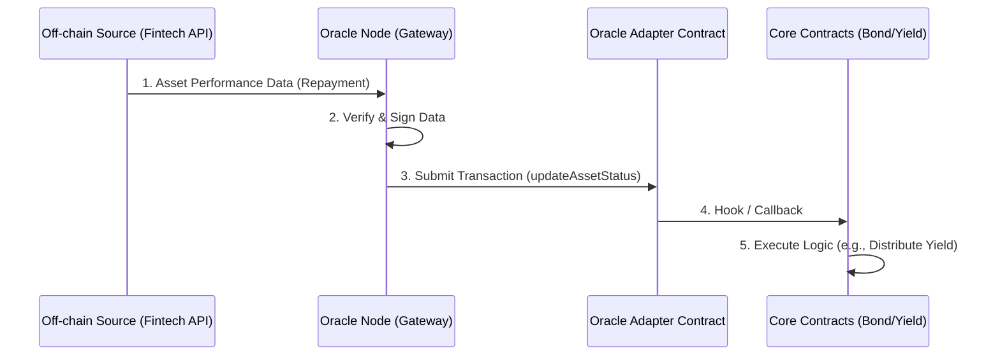

# 14. Oracle Integration Architecture

## 1. 개요 (Overview)
BuildCTC는 실물 자산(RWA, Real World Assets)을 블록체인 상으로 가져와 투자 상품화하는 플랫폼입니다. 블록체인 외부(Off-chain)에 존재하는 실제 자산의 상태(상환 여부, 성과, 신용 등급 등)를 블록체인 내부(On-chain)의 스마트 컨트랙트가 신뢰할 수 있게 검증하고 가져오기 위해서는 **오라클(Oracle)** 시스템이 필수적입니다.
본 문서는 **Creditcoin Universal Oracle**을 활용한 데이터 연동 아키텍처를 정의합니다.

## 2. 목표 (Goals)
1.  **데이터 무결성(Integrity)**: 외부 데이터가 스마트 컨트랙트로 전달되는 과정에서 변조되지 않았음을 보장.
2.  **자동화(Automation)**: 채무자의 상환 내역이나 자산 가치 변동이 자동으로 컨트랙트에 반영되어 수익 배분 등을 트리거.
3.  **투명성(Transparency)**: 오라클을 통해 가져온 모든 데이터와 그 출처를 온체인에 기록하여 누구나 검증 가능하게 함.

## 3. 오라클 아키텍처 (Architecture)

### 3.1 전체 흐름 (Data Flow)


### 3.2 주요 컴포넌트

#### A. Off-chain Data Source (Fintech Partner API)
*   실제 대출/투자 집행 기관(핀테크 파트너)의 ERP 또는 API 시스템.
*   **Provision Data**:
    *   `loan_id`: 대출 고유 식별자.
    *   `repayment_amount`: 상환된 원리금.
    *   `repayment_date`: 상환 일시.
    *   `status`: 정상(Normal), 연체(Overdue), 부도(Default).

#### B. Oracle Node (Gateway Service)
*   **Creditcoin Universal Oracle Gateway** 역할 수행.
*   주기적으로(Polling) 또는 Webhook 방식으로 파트너 API의 데이터를 수집.
*   데이터를 표준화된 포맷으로 변환하고 자신의 개인키(Oracle Private Key)로 서명하여 온체인 트랜잭션 생성.
*   **구현 기술**: Node.js/NestJS 또는 Go (Serverless Functions 권장).

#### C. Oracle Adapter Contract (`OracleAdapter.sol`)
*   오라클 노드로부터 데이터를 수신하는 스마트 컨트랙트 창구.
*   **보안 기능**:
    *   `Trusted Oracle Registry`: 사전에 승인된 오라클 주소(Address)로부터 온 트랜잭션만 허용.
    *   `Events`: 데이터 업데이트 시 `AssetStatusUpdated` 이벤트 발생.
    *   `Interface`: `IOracleAdapter.sol` 인터페이스 제공.

## 4. 데이터 모델 (On-chain Data Structure)

### 4.1 Asset Snapshot
스마트 컨트랙트에 기록될 자산 상태 구조체입니다.
```solidity
struct AssetPerformance {
    uint256 timestamp;      // 업데이트 시각
    uint256 principalPaid;  // 상환된 원금 누적액
    uint256 interestPaid;   // 상환된 이자 누적액
    uint8 status;           // 0: Active, 1: Repaid, 2: Default
    string verifyProof;     // 외부 검증 증명 (IPFS Hash 등)
}
```

## 5. 단계별 구현 계획 (Implementation Phases)

### Phase 1: 오라클 어댑터 초안 (Mock Oracle)
*   개발 및 테스트 목적의 단순화된 오라클.
*   **`MockOracle.sol`**:
    *   `setAssetData(uint256 bondId, uint256 amount)` 함수로 누구나(또는 Admin만) 데이터 주입 가능.
    *   프론트엔드 및 YieldDistributor 로직 테스트용.

### Phase 2: Trusted Oracle Adapter
*   **`OracleAdapter.sol`**:
    *   AccessControl 도입 (`ORACLE_ROLE`).
    *   실제 `YieldDistributor` 컨트랙트가 이 어댑터를 참조하여 수익 배분 가능 여부를 판단하도록 연결.

### Phase 3: 백엔드 게이트웨이 구축
*   핀테크 파트너의 Mock API 서버 구축.
*   이를 주기적으로 체크하여 `OracleAdapter`의 `updateData`를 호출하는 **Relayer Bot** 개발.

## 6. 결론 (Conclusion)
오라클 연동은 BuildCTC가 단순한 토큰 놀이가 아닌 실제 금융 시스템으로 작동하게 하는 핵심입니다. 초기 단계(Phase 1)에서는 `MockOracle`을 통해 빠르게 기능성을 검증하고, 점차 탈중앙화된 신뢰 모델로 고도화할 것입니다.
