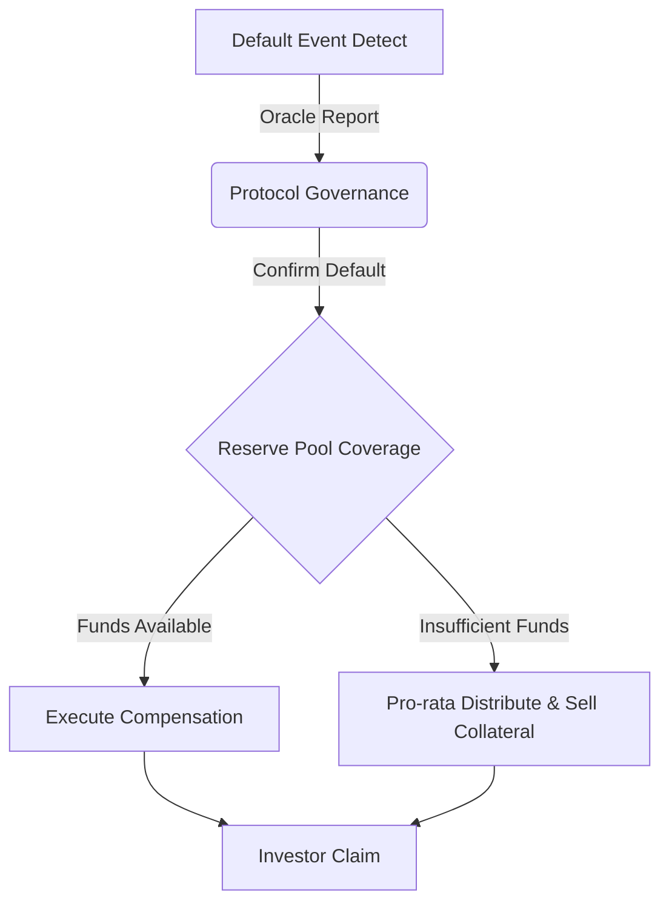

# 15. Risk Management System Design

## 1. 개요 (Overview)
금융 플랫폼, 특히 실물 자산(RWA) 기반 대출 플랫폼에서 리스크 관리는 투자자 신뢰와 지속 가능성을 위한 가장 중요한 요소입니다. 채무 불이행(Default)은 언제든 발생할 수 있으며, 이에 대한 체계적인 대비책이 시스템 레벨(Smart Contract)에서 구현되어야 합니다.
본 문서는 **리저브 풀(Reserve Pool)**을 이용한 손실 보전 메커니즘과 디폴트 처리 프로세스를 정의합니다.

## 2. 목표 (Objectives)
1.  **투자자 보호 (Investor Protection)**: 채무 불이행 발생 시 원금의 일부 또는 전액을 보전.
2.  **자동화된 대응 (Automated Response)**: 오라클을 통해 디폴트가 확인되면 즉시 프로토콜 레벨에서 대응 로직(보험금 지급 등) 실행.
3.  **투명한 적립 (Transparent Funding)**: 수익의 일정 비율이 투명하게 리저브 풀로 적립되는 과정 공개.

## 3. 리스크 관리 메커니즘 (Mechanism)

### 3.1 리저브 풀 (Reserve Pool)
리저브 풀은 플랫폼의 "보험금" 역할을 하는 스마트 컨트랙트입니다.

*   **재원 마련 (Funding Source)**:
    *   **Spread Fee**: 대출 금리와 투자자 제공 금리 사이의 차익(Spread) 중 일부(예: 10%)를 자동 적립.
    *   **Protocol Fee**: 플랫폼 수수료의 일부 적립.
*   **운용**: 안전 자산(USDC, Stablecoin) 형태로 보관되며, 평상시에는 출금이 제한됩니다.

### 3.2 디폴트 처리 프로세스 (Default Handling Process)


1.  **감지 (Detection)**: `OracleAdapter`가 특정 채권의 상태를 `Default(2)`로 업데이트.
2.  **트리거 (Trigger)**: 상태 변경 시 `LiquidityPool` 또는 별도의 `InsuranceManager` 컨트랙트가 `processDefault(bondId)` 함수 실행.
3.  **보상 (Compensation)**:
    *   해당 Bond의 미상환 원금 계산.
    *   `ReservePool`에서 가능한 범위 내에서 자금 인출.
    *   해당 Bond 보유자(Token Holder)들에게 `USDC` 지급 (또는 청구권 토큰 발행).

## 4. 스마트 컨트랙트 설계 (Smart Contract Design)

### 4.1 ReservePool.sol
```solidity
contract ReservePool is AccessControl, ReentrancyGuard {
    IERC20 public usdc;
    uint256 public totalReserves;

    // 풀에 자금 저장 (수익 분배 시 자동 호출)
    function depositReserve(uint256 amount) external;

    // 손실 보전 실행 (Admin 또는 InsuranceManager만 호출 가능)
    function coverLoss(address recipient, uint256 amount) external onlyRole(INSURANCE_ROLE);
    
    // 비상 인출 (Governance 다중 서명 필요)
    function emergencyWithdraw(address to, uint256 amount) external onlyRole(DEFAULT_ADMIN_ROLE);
}
```

### 4.2 수익 배분 로직 수정 (In YieldDistributor)
기존 `YieldDistributor`에 리저브 적립 로직을 추가해야 합니다.
```solidity
function distributeYield() external {
    uint256 totalYield = ...;
    uint256 reserveAmount = (totalYield * RESERVE_RATE) / 100; // 예: 10%
    uint256 distributableAmount = totalYield - reserveAmount;

    // 리저브 풀로 송금
    usdc.transfer(address(reservePool), reserveAmount);
    reservePool.depositReserve(reserveAmount);

    // 나머지 투자자 분배
    ...
}
```

## 5. 단계별 구현 (Implementation Strategy)

### Phase 1: 기본 적립 (Accumulation)
*   [ ] `ReservePool.sol` 컨트랙트 구현 및 배포.
*   [ ] `YieldDistributor`에 `ReservePool` 주소 등록 및 적립 로직(`RESERVE_RATE`) 추가.

### Phase 2: 수동 보상 (Manual Cover)
*   [ ] 디폴트 발생 시 Admin이 수동으로 `coverLoss`를 호출하여 피해 투자자들에게 에어드랍하는 기능.

### Phase 3: 자동화 및 보험 청구 (Automated Claim)
*   [ ] 사용자가 자신의 파산한 채권 토큰(`BondToken`)을 소각(Burn)하고, 리저브 풀에서 보상금을 `Claim`하는 기능 구현.

## 6. 결론
리스크 관리 시스템은 BuildCTC의 지속 가능성을 담보하는 최후의 보루입니다. 초기에는 단순한 적립 모델로 시작하여, 향후 정교한 보험수리적 모델과 거버넌스를 통한 통제를 도입할 것입니다.
